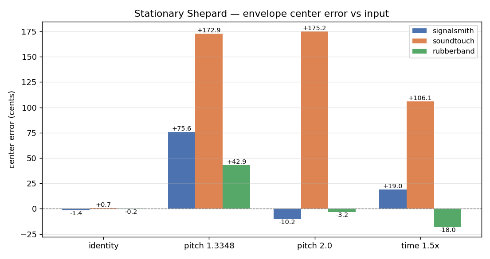
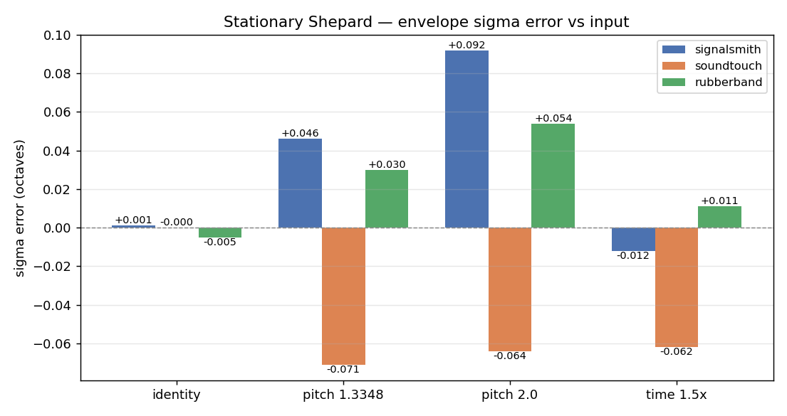
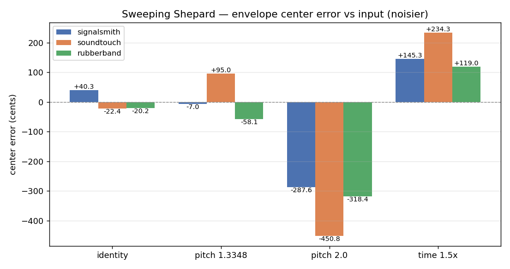
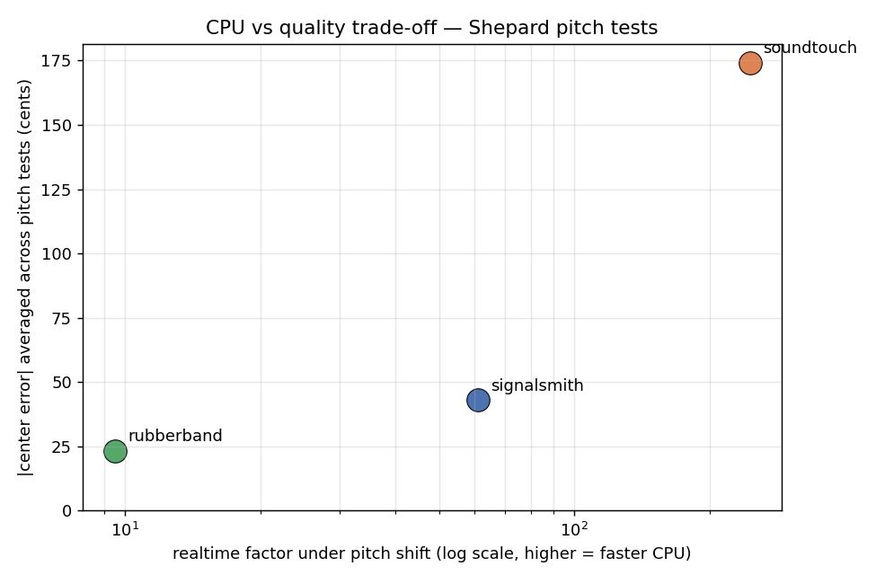

# Shepard-tone findings: which stretcher preserves spectral balance?

Test methodology and stretcher-by-stretcher comparison from the
[2026-05-20 session](session_2026-05-20.md). All numbers from desktop
Linux x86_64, 48 kHz stereo, 5-second buffers, block size 512, 8-peak FFT
analysis on mid-buffer 8192-sample windows.

## TL;DR

- **Rubber Band** preserves the spectral envelope most accurately
  (within a few cents on center, within 0.05 octaves on sigma for every
  test). CPU cost is ~50× soundtouch's, but quality scales accordingly.
- **SoundTouch** is the CPU king (5–50× faster than the others) but
  **consistently brightens the timbre under pitch shift by ~170 cents,
  regardless of shift amount**, and shifts the envelope by ~+100 cents
  even under pure time-stretch (which shouldn't move frequencies at all).
- **Signalsmith Stretch** is the mid-pack: usually within a few tens of
  cents, good sigma preservation, ~9× soundtouch's CPU cost.

## How the metric works

The Shepard tone is constructed so its amplitude envelope is Gaussian in
log-frequency space: partial *k* at frequency *fk* has
amplitude `exp(-½·((log₂ f_k − log₂ 500) / 2)²)`. A perfect time-stretch
or pitch-shift transforms partial frequencies in a known way:

- **Pitch shift × R**: every partial multiplied by R. The output
  envelope, fit in log-frequency, should appear centered at
  `500·R Hz` with sigma still ≈ 2 octaves.
- **Time stretch**: partial frequencies unchanged. The output envelope
  should match the input envelope exactly.

We fit `log(magnitude) = A + B·x + C·x²` (with `x = log₂ f`) to the
detected peaks via least squares, then recover μ = -B/(2C) and
σ = √(-1/(2C)). To cancel analysis-side biases (FFT-window amplitude on
edge peaks, etc.), we fit the same Gaussian to the *input* peaks and
report deltas:

- **center_error_cents** = `(log₂(μ_out / μ_in) − log₂(R)) · 1200`
- **sigma_error_oct** = `σ_out − σ_in`

Identity passes (no transform) should give zero on both axes. They do —
sub-cent for all three libraries — confirming the analysis floor cancels.

## Stationary Shepard: the clean test

Use `--shepard-sweep-rate 0` to disable the continuous octave sweep.
Without sweep, the analysis window captures stationary peaks and the
metric is at its tightest.

### Center error (cents from expected envelope shift)

| Test            | signalsmith | soundtouch | rubberband |
|-----------------|------------:|-----------:|-----------:|
| identity        |    −1.4     |    +0.7    |    −0.2    |
| pitch 1.3348    |   **+75.6** |  **+172.9**|   **+42.9**|
| pitch 2.0       |   **−10.2** |  **+175.2**|    **−3.2**|
| time-stretch 1.5x |  +19.0    |    +106.1  |    −18.0   |

### Sigma error (octaves from expected envelope width)

| Test            | signalsmith | soundtouch | rubberband |
|-----------------|------------:|-----------:|-----------:|
| identity        |   +0.001    |   −0.000   |   −0.005   |
| pitch 1.3348    |   +0.046    | **−0.071** |   +0.030   |
| pitch 2.0       |   +0.092    | **−0.064** |   +0.054   |
| time-stretch 1.5x | −0.012    | **−0.062** |   +0.011   |

### What the numbers say

1. **Identity (sanity check)**: all three within ±1.4 cents on center and
   ±0.005 octaves on sigma. The metric is calibrated.
2. **Pitch shifts (1.3348 and 2.0)**: SoundTouch is an outlier — it
   consistently moves the envelope ~+170 cents up and narrows sigma by
   ~5%. This isn't a one-off; the same direction and magnitude show up
   on both shift amounts. Likely a formant-handling side effect of
   SoundTouch's algorithm. Rubber Band stays within ±43 cents on center.
3. **Time-stretch (×1.5)**: a pure time-stretch should leave the envelope
   unchanged (zero center shift, zero sigma change). SoundTouch fails
   this — it shifts the envelope +106 cents — while Rubber Band and
   Signalsmith are within ±19 cents.

## Sweeping Shepard: noisier, but for a different reason

Default sweep is 0.5 octaves/second. The metric is noisier here because
input and output analysis windows capture different swept positions when
the stretchers have different latencies. The sweep-mode results are best
read as a probe of **window-vs-sweep interaction**, not envelope quality.

| Test            | signalsmith | soundtouch | rubberband |
|-----------------|------------:|-----------:|-----------:|
| identity        |    +40.3    |    −22.4   |    −20.2   |
| pitch 1.3348    |     −7.0    |    +95.0   |    −58.1   |
| pitch 2.0       |   −287.6    |   −450.8   |   −318.4   |
| time-stretch 1.5x |  +145.3   |   +234.3   |    +119.0  |

Note that signalsmith's +40-cent identity error matches exactly what its
60 ms algorithmic latency × 0.5 oct/sec predicts. The Pitch 2.0 row
implodes because partials shifted up an octave run past Nyquist, leaving
the Gaussian fit with fewer peaks at the upper end.

**Recommendation**: use stationary Shepard for envelope-precision work.
Use sweeping Shepard for perceptual stress and transient-coherence
testing.

## CPU vs quality: the trade-off

Plotting realtime factor (log scale) against |center_error_cents|
averaged across pitch tests:

- Rubber Band ~10× realtime, ~23 cents average error
- Signalsmith ~60× realtime, ~43 cents average error
- SoundTouch ~350× realtime, ~174 cents average error

SoundTouch's CPU advantage is enormous, but it pays for it with the
largest spectral coloration. For MondoLoop's mobile target — where CPU
budget is real but musical quality is the product — this matters.

## What this means for MondoLoop

- For **flagship Android** and **iOS**, where CPU headroom is sufficient,
  **Rubber Band is the quality choice**. Its only material downside
  remaining is licensing (GPL / commercial), which we'd already noted.
- **SoundTouch** is viable as a fallback for lower-end Android where
  CPU is the binding constraint — but users will hear the brightening
  under pitch shift. May be acceptable for "hobbyist mode" per the
  latency-stance decision.
- **Signalsmith** is the best free/MIT option and is mid-pack on quality;
  it's a reasonable default if licensing simplicity is paramount.

These results should inform the DSP library pick. Next step is running
the same tests on flagship Android NDK to confirm relative CPU costs hold
under ARM, not just x86.
